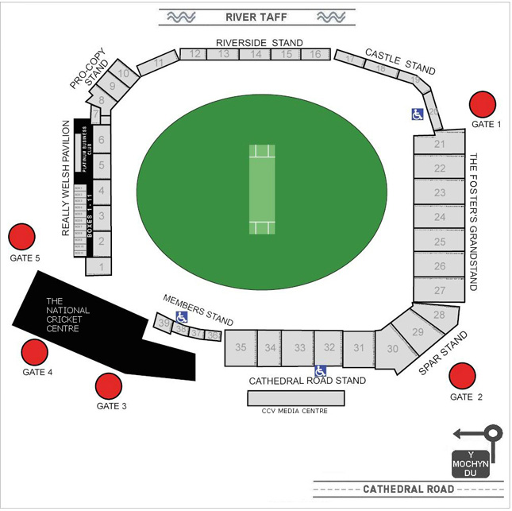

##### Seat selection properties

The `seatmaps` attribute, added to the General Product attributes, describes the seat selection functionality.

A seatmap is a JSON object that describes an overview of the entire seating
area (the `root`), and also the references to specific seating sections
(`seats`).

A seatmap can be constructed from an image, and then use a JSON document to describe the seating around it.
This example displays an image with the seating areas, overlaid on top of it.

Every seatmap must have a `root` attribute, and then a list of sub seating
reference attributes. The `root` attribute specifies the `"sub"` attribute
that defines the reference for a particular sub block of seats.
For example:

    "seatmaps": {
      "root": {
        "h": "780",
        "w": "968",
        "img": "o2-arena-image.png",
        "seats": [
          {
            "sh": "p",
            "pts": "450,653,493,660,486,746,431,737",
            "id": "my_ref_code1",
            "sub": "my_ref_code1"
          },
          { ... },
        ]
      },
      "my_ref_code1": {
        "h": 434,
        "n": "",
        "t": "my_ref_code1",
        "w": 476,
        "img": "o2-north-stand.png",
        "seats": [
          {
            "s": "34",
            "sh": "c",
            "pts": "42,28,6",
            "id": "1-180",
          },
          {
            "s": "34",
            "sh": "c",
            "pts": "56,28,6",
            "id": "1-179",
          },
          { ... },
        ]
      },
    }

